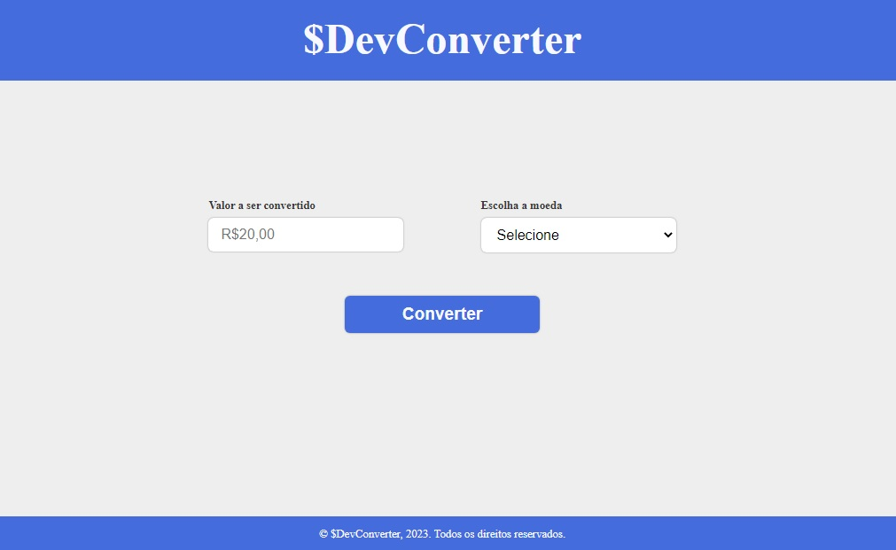

<h1 align center>


<p>Conversor de moeda 💰</p>
</h1>

## 📚 About
Conversor de moeda para verificar a equivalência de valores entre 2 moedas, como **Dólar** (USD) e **Euro** (EUR)

## 💭 Importance of currency converter
Entender a conversão das moedas é fundamental para situações cotidianas, como a compra de produtos e serviços estrangeiros, viagens, realização de operações de comércio exterior e até para receber por algum serviço prestado para empresa de outro país.

## 💻 Tools
- [HTML](https://developer.mozilla.org/pt-BR/docs/Web/HTML)
- [CSS](https://developer.mozilla.org/pt-BR/docs/Web/CSS)
- [JAVASCRIPT](https://www.javascript.com/)

## ♻ How Contribute
```bash
#clone the project
$ git clone https://github.com/olcsdantas/devConverter.github.io 
```

```bash
# Enter directory
$ cd devConverter
```

```bash
# Install the dependencies, if use npm
$ npm install
```
<p>or</p>

```bash
# Install the dependencies, if use npm
$ yarn
```

## 📜 License
This project is under the Mit License. See the file LICENSE for more details.